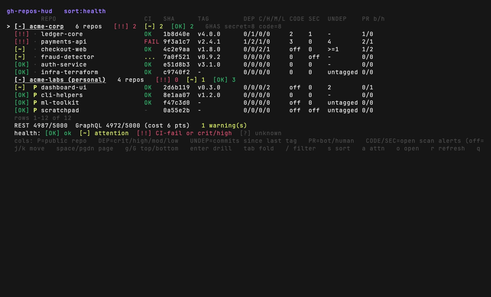
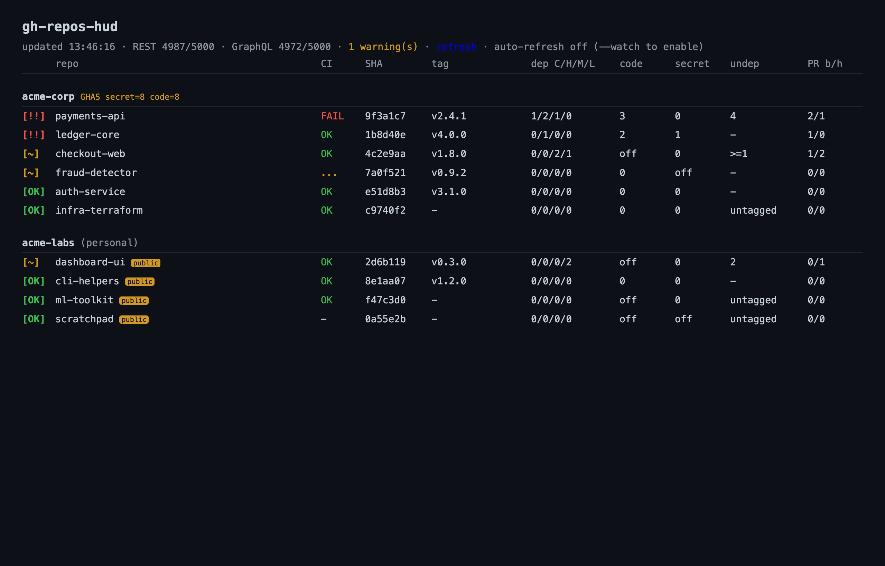

# gh-repos-hud

A heads-up display of repo health across every GitHub organization you belong
to (plus your personal repos), as a [`gh`](https://cli.github.com) extension.

One glance shows, per repo, grouped by org:

- **Health** rollup (`[OK]` / `[~]` / `[!!]`) from CI + alerts + undeployed changes
- **CI** status of the latest run on the default branch
- current **short SHA** and **latest version tag / release**
- **undeployed changes** — commits on the default branch since the last tag
- **Dependabot** alerts by severity, plus **code-scanning** and **secret-scanning** counts
- **scanning coverage** (enabled?) and active paid **GHAS** spend per org
- open **PRs** split into Dependabot-vs-human, with mergeable / CI-green counts

Auth is sourced from `gh` — **no token is ever embedded or stored** by this tool.

## Install

```sh
gh extension install chadmayfield/gh-repos-hud
```

## Usage

```sh
gh repos-hud                      # interactive TUI (default)
gh repos-hud serve --port 8787    # local web dashboard at http://127.0.0.1:8787
gh repos-hud serve --watch        # web dashboard that auto-refreshes (default: on-demand)
gh repos-hud --json               # machine-readable snapshot
gh repos-hud --org my-org         # limit to specific orgs (repeatable)
gh repos-hud --only-attention     # only repos needing attention (non-green)
gh repos-hud --watch              # TUI auto-refresh (default: manual 'r' only)
gh repos-hud --demo               # synthetic data — try it without your own repos
```

**TUI keys:** `j/k` move · `space`/`pgdn`/`g`/`G` page · `enter` drill in (alerts/PRs) ·
`tab` fold org · `s` sort · `/` filter · `a` attention-only · `o` open · `r` refresh · `q` quit.

**Caching:** a 5-min disk cache means repeated runs make zero API calls; `r`/`--no-cache`
force fresh. The footer shows GraphQL point-cost per fetch and backs off auto-refresh when
the budget is low.

**Config (optional):** `~/.config/gh-repos-hud/config.yml` — see `config.yml.example`
(org include/exclude, personal/archived, refresh interval, cache TTL, port). Flags override it.

Requires a `gh` login with at least `repo` and `read:org` scopes;
`security_events` / `admin:org` enable the code/secret-scanning and GHAS-billing
columns (missing scopes degrade those cells to `?` rather than failing).

## Build from source

```sh
make build      # -> ./gh-repos-hud
make install    # gh extension install . (run as `gh repos-hud`)
make test lint vuln
```

## Demo

`--demo` renders a built-in synthetic dataset — two fictional orgs and ten
repositories engineered to exercise every column and health state — instead of
querying GitHub. It needs no network access and touches no real repository, so
it's useful for trying the HUD, demos, and regenerating the images below:

```sh
gh repos-hud --demo               # TUI with synthetic data
gh repos-hud serve --demo         # web dashboard with synthetic data
```

The interactive TUI:



The local web dashboard (`gh repos-hud serve`):



The TUI image is regenerated with [vhs](https://github.com/charmbracelet/vhs):
`vhs docs/demo-tui.tape`.

## License

[MIT](LICENSE)
